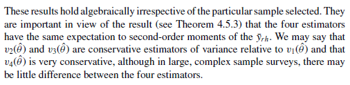
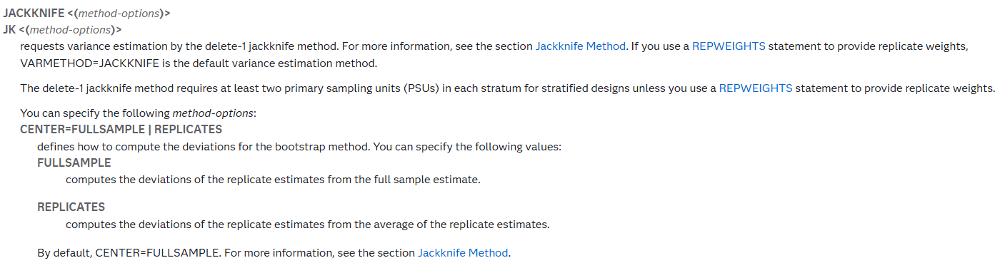

```{r, include = FALSE}
knitr::opts_chunk$set(
  collapse = TRUE,
  comment = "#>"
)
```

```{r setup, include = FALSE}
knitr::opts_chunk$set(echo = TRUE, warning = FALSE, message = FALSE)
library(tidyverse)
library(varianceSILC)
```

# Introduction

L’estimation correcte de la variance dans les enquêtes complexes
nécessite de tenir compte du plan de sondage (stratification, grappe,
pondération, etc.). Les poids répliqués permettent de reproduire
l’impact du plan d’échantillonnage sans devoir le reconstituer
complètement. Chaque réplication correspond à une version alternative de
l’échantillon, dans laquelle une PSU a été retirée (et ses voisines
compensées).

L'estimation de la variance de SILC est réalisé, à Statbel, à l'aide
d'un script SAS conçu spécifiquement pour l'enquête. Il intègre toutes
les demandes de variance du service thématique et des organismes
extérieurs. Au fil du temps, il a été amélioré, notamment en 2022 en
réduisant l'impact de la détermination de la médiane sur les indicateurs
de taux de pauvreté.

Néanmoins, à ce jour, seul le service méthodologie de Statbel peut
effectuer l'estimation de la variance d'indicateurs pour SILC, et cet
écueil limite la diffusion de nos résultats en prenant en compte
l'incertitude de l'enquête. Nos collègues de l'IWEPS ont proposé, il y a
quelques années, de recourir à l'utilisation du package `survey`, afin
d'intégrer les PSU et donc de coller au mieux au plan de sondage. Cette
approche sur-estime légèrement la variance obtenue.

Afin de permettre à nos utilisateur·rices extérieur·es d'utiliser au
mieux les résultats de l'enquête SILC, nous souhaitons à présent
diffuser les poids répliqués provenant de la procédure de Jackknife, et
fournir une méthodologie pour expliquer leur usage. Le package `survey`
permet d'utiliser les poids répliqués dans l'estimation de la variance,
mais il semblerait que l'usage par défaut ne colle pas parfaitement au
plan de sondage, aussi il nous semble intéressant de proposer une
variante à ce package, spécifiquement pour le plan de sondage établi à
Statbel pour l'enquête SILC.

Le package `varianceSILC` est un outil interne destiné à faciliter
l'utilisation des poids répliqués pour l'estimation de la variance des
indicateurs produits à partir des données SILC. Il propose une méthode
cohérente avec les principes du jackknife stratifié, tout en résolvant
certaines limitations des approches génériques fournies par le package
`survey`.

Dans ce document, nous expliquons : - le principe des poids répliqués, -
la méthode d'estimation utilisée dans `survey`, - les différences
identifiées avec notre macro, - des résultats empiriques démontrant leur
proximité, - et des recommandations pratiques pour vos analyses.

# Poids répliqués et estimation de la variance

Les poids répliqués permettent d'estimer la variance d'un estimateur
sans reproduire l'intégralité du plan de sondage. Chaque jeu de poids
correspond à un "scénario alternatif" dans lequel une unité primaire
(PSU) est retirée et les autres sont ajustées.

Cette méthode est utile pour refléter la stratification et les grappes,
intégrer la pondération et tenir compte du calage et de la non-réponse
(via les poids). Cette méthode permet également d'estimation la variance
pour des indicateurs plus complexes (Gini, S80/S20).

Le manuel "Introduction to Variance Estimation" de Wolter présente les
formules exactes et les variantes permettant d'estimer une variance dans
le cas d'une procédure jackknife stratifié. Nous livrons ici une
analyse de ces formules, et mettons en évidence le fait que le package
`survey` a une approche plus conservatrice (donc surévaluant
l'estimation de la variance) que celle utilisée par Statbel. Pour cela, nous
résumons la section "4.5. Usage in Stratified Sampling" du manuel.

## Contexte méthodologique

On considère une population divisée en $H$ strates, avec un
échantillonnage aléatoire dans chaque strate. Le paramètre d’intérêt est
une fonction $\theta=g(\bar Y_1,…,\bar Y_H)$ des moyennes des strates.
L’objectif est d’estimer la variance de $\hat{\theta}$ à l’aide du
jackknife.

À chaque réplication, une observation est supprimée dans une strate $h$,
et un estimateur $\hat\theta_{hi}$ est recalculé. Quatre variantes
d’estimateurs de variance peuvent être construites à partir de ces
réplications. Nous présentons ici la version générique présentée par
Jones (1974)[^1] :

[^1]: Jones, H. L. (1974). Jackknife Estimation of Functions of Strata
    Means. Biometrika 61, 343–348.

$$
V(\hat\theta)=\sum_{h=1}^L\frac{n_h-1}{n_h} \sum_{i=1}^{n_h}(\hat\theta_{hi} - f(\theta))^2
$$

avec :

-   $L$ : Nombre de strates (ici des pseudo-strates pour représenter le
    tirage systématique)

-   $n_h$ : nombre de réplications par strate

-   $\hat\theta_{hi}$ : Estimateur répliqué pour la strate $h$ et la PSU
    retirée $i$

-   $f(\theta)$ : un paramètre fonction de $\theta$ servant de point de
    comparaison pour calculer les écarts.

Le point important ici est que dans le manuel de Jones, 4 variantes
existent pour le $f(\theta)$ , et chaque estimation est sans biais de la
variance de l'indicateur. :

-   v1 : $f(\theta) = \hat\theta_h$ : moyenne des estimateurs de
    réplication au sein de la strate $h$
-   v2 : $f(\theta) = \hat\theta_.$ : Moyenne des estimateurs répliqués
-   v3 : $f(\theta) = \overline\theta_.$ : Moyenne des estimateurs de
    l'échantillon initial
-   v4 : $f(\theta) = \hat\theta$ : Estimateur dans l'échantillon
    initial

Remarque : J'ai vraiment un doute sur la version v3, je ne suis pas sûr
de comprendre totalement la terminologie employée dans le manuel. Mais,
comme nous le voyons par la suite, aucun logiciel ne semble utiliser
cette variante.

L'auteur explique que la variante v1 est plus fidèle à la structure de
l’échantillon, en particulier lorsque les strates sont de taille
inégale, les indicateurs sont fortement hétérogènes entre strates ou la
variance intra-strate est un enjeu. Les autres variantes sont plus
simples à calculer car on inclue toujours le même paramètre quelle que
soit la strate, mais peuvent **surévaluer la variance** car elle inclut
la variabilité entre strates. La variante v4 est d'ailleurs indiqué
comme une approche conservatrice. Les 4 variantes sont asymptotiquement
identiques.

```{r out.width = '80%', echo = FALSE}

```

Les logiciels statistiques semblent avoir choisi des variantes
différentes dans leur implémentation du calcul de variance par la
méthode du jackknife stratifié. Le package survey de R semble utiliser
la moyenne des réplications, donc la variante v2 : "The variance is
computed as the sum of squared deviations of the replicates from their
mean" ([documentation du package `survey`, fonction
`svrepdesign`](https://r-survey.r-forge.r-project.org/survey/html/svrepdesign.html)).
Le logiciel SAS propose deux options pour calculer la variance :
utiliser l'estimateur de l'échantillon initial (donc la variante v4) ou
la moyenne des estimateurs répliqués (donc la variante v2). SAS propose
par défaut la variante v4.

```{r out.width = '100%', echo = FALSE}

```

D'après ma compréhension des documentations, Le package `survey` utilise
donc la variante v2, et SAS propose un choix parmi les variantes v2 et
v4. Le service méthodologie de Statbel a implémenté originalement la
formule v1, à partir des formules exactes. Notre estimation prend mieux
en compte l'homogénéité intra-strate et permet donc de bénéficier du
tirage systématique dans le plan de sondage. Néanmoins, la formule est
plus gourmande en calcul. À l'inverse, pour les variantes v2 et v4,
l'écart est toujours calculé par rapport à un seul estimateur (provenant
des réplications, ou de l'échantillon global), quelle que soit la
réplication et sa strate d'origine. Le calcul est néanmoins plus simple
à mener, et les résultats sont asymptotiquement identiques. Dans la
suite du document, je souhaite présenter les différences obtenues entre
les deux variantes v1 et v2.

$$
V_1(\hat\theta)=\sum_{h=1}^L\frac{n_h-1}{n_h} \sum_{i=1}^{n_h}(\hat\theta_{hi} - \hat\theta_h)^2
$$

$$
V_2(\hat\theta)=\sum_{h=1}^L\frac{n_h-1}{n_h} \sum_{i=1}^{n_h}(\hat\theta_{hi} - \hat\theta_.)^2
$$

# Illustration des différences

## Données simulées

Nous commençons par construire un exemple synthétique simple, composé de
300 individus répartis équitablement dans deux pseudo-strates. Chaque
pseudo-strate contient deux unités primaires de sondage (PSU), soit
quatre PSU au total. Tous les individus reçoivent un poids initial RB050
de 100. Une variable binaire MIN60 est générée aléatoirement pour
simuler le statut de pauvreté (30% de personnes), et une variable de
sexe RB090 prend les modalités "homme" ou "femme".

```{r}
nb_IND <- 300
taille_strate_1 <- 2
taille_strate_2 <- 2
set.seed(123)

DB <- tibble(
  ID = 1:nb_IND,
  RB050 = 100,
  STRATE = c(rep(1,nb_IND/2),rep(2,nb_IND/2)),
  SCALE = c(rep((taille_strate_1-1)/taille_strate_1,nb_IND/2),
            rep((taille_strate_2-1)/taille_strate_2,nb_IND/2)),
  PSU = as.numeric(paste0(STRATE,c(
    unlist(lapply(1:taille_strate_1,function(x) rep(x,nb_IND/2/taille_strate_1))),
    unlist(lapply(1:taille_strate_2,function(x) rep(x,nb_IND/2/taille_strate_2)))
  ))),
  MIN60 = as.numeric(runif(nb_IND) > 0.7),
  RB090 = sample(c("Homme","Femme"),nb_IND,TRUE)
)
```

Pour chaque pseudo-strate, nous définissons une procédure de répliques
selon la méthode du jackknife. À chaque réplication, une PSU est retirée
(les poids des unités appartenant à cette PSU sont mis à zéro), et les
unités de l’autre PSU reçoivent un poids multiplié par l’inverse du
facteur de correction (soit 1 / 0.5 = 2), conformément à la méthode du
jackknife stratifié. Une petite variation aléatoire est ajoutée aux
poids pour simuler de légères fluctuations provoquées par le
ré-échantillonnage. On conserve les variables et informations concernant
la réplication avec le suffixe \_JCK.

```{r}
DB_JCK <- unique(DB$PSU) %>% map_df(~{
  strate_jck <- DB %>% filter(PSU == .x) %>% pull(STRATE) %>% unique()
  scale_jck <- DB %>% filter(PSU == .x) %>% pull(SCALE) %>% unique()
  DB %>%
    select(ID,STRATE,PSU,RB050,SCALE) %>%
    mutate(
      ALEA = round(runif(nrow(DB),-25,25)),
      PSU_JCK = .x,
      STRATE_JCK = strate_jck,
      SCALE_JCK = scale_jck,
      RB050 = case_when(
        STRATE != STRATE_JCK  ~ RB050 + ALEA,
        PSU != PSU_JCK ~ RB050*1/SCALE_JCK + ALEA,
        TRUE ~ 0
      ))
})
```

Les poids répliqués sont redressés afin que leur somme reste constante à
30 000 pour chaque réplication. La base finale contient ainsi une ligne
par individu et par réplication, soit 1 200 lignes au total (300
individus × 4 réplications). Ce format garantit que chaque PSU est
utilisée une fois comme unité supprimée, en respectant la structure de
stratification.

```{r}
DB_JCK <- DB_JCK %>%
  mutate(ID_JCK = as.numeric(factor(PSU_JCK))) %>%
  group_by(STRATE_JCK,PSU_JCK) %>%
  mutate(RB050 = RB050*(nb_IND*100)/sum(RB050)) %>%
  ungroup()

DB_JCK %>% group_by(STRATE,PSU) %>% count()

DB_JCK %>% group_by(ID_JCK,STRATE_JCK,PSU_JCK,SCALE_JCK) %>%
  summarise(N = n(),SUM_RB050 = sum(RB050))
```

Afin de pouvoir utiliser le package `survey`, nous transformons la base
longue des poids répliqués en format large, où chaque réplication
devient une colonne (ici `RB050_REP_1`, `RB050_REP_2`, etc.). On
récupère ensuite la matrice des poids répliqués.

```{r}
repweights_matrix <- DB_JCK %>%
  select(ID, PSU_JCK, RB050) %>%
  arrange(PSU_JCK) %>%
  pivot_wider(
    id_cols = ID,
    names_from = PSU_JCK,
    values_from = RB050,
    names_prefix = "WEI_REP_"
    ,values_fill = 0
  ) %>% 
  select(starts_with("WEI_REP_")) %>% 
  as.matrix()
```

Nous extrayons également le vecteur des facteurs de correction
(`rscales`), qui est ici constant à 0.5, car chaque pseudo-strate
contient exactement deux PSU. Attention, ici, il faut respecter l'ordre
des données pour garantir la bonne estimation de la variance.

```{r}
scale_vector <- DB_JCK %>% select(PSU_JCK,SCALE_JCK) %>%
  arrange(PSU_JCK) %>% distinct() %>% pull(SCALE_JCK)
```

Nous construisons alors un objet `svrepdesign` avec les poids répliqués.
Celui-ci inclut la base d’origine, les poids complets, la matrice des
poids répliqués, le vecteur de correction. Il faut indiquer que nous
utilisons une méthode jackknife stratifiée (`type = "JKn"`). Le
paramètre `scale = 1` indique que nous n'appliquons aucun facteur de
correction supplémentaire sur l'ensemble des poids.

```{r}
design_v2 <- survey::svrepdesign(
  data = DB,
  weights = ~RB050,
  repweights = repweights_matrix,
  scale = 1,
  rscales = scale_vector,
  type="JKn"
)
```

Nous procédons ensuite à l’estimation de la moyenne de l’indicateur
`MIN60` selon le sexe (`RB090`), à l’aide de la fonction `svyby` pour
les sous-groupes, complétée par un appel à `svymean` pour la population
totale. Les résultats montrent environ 28 % de pauvreté globale pour cet
exemple, avec 23 % chez les hommes et 33 % chez les femmes. Les
erreurs-types sont respectivement de 0.057 et 0.032. On conserve les
résultats de cette v2 venant du package `survey` dans un `data.frame`
pour une comparaison ensuite.

```{r}
survey::svymean(~MIN60,design_v2)

survey::svyby(~MIN60,~RB090,design_v2,survey::svymean)

resultats_v2 <- survey::svyby(~MIN60,~RB090,
                            design_v2,survey::svymean) %>%
  add_row(data.frame(survey::svymean(~MIN60,design_v2)) %>%
            rename(MIN60=mean,se=SE) %>%
            mutate(RB090 = "All")) %>%
  mutate(indic = "MIN60") %>% 
  rename(mean = MIN60) %>% 
  select(indic,RB090,mean,se)
```

Nous proposons en parallèle une autre fonction `my_svyrepdesign` qui
imite la fonction `svrepdesign` pour la version v1 de la formule
d'estimation de la variance : il s'agit de définir tout d'abord un
design de plan de sondage, avec tous les éléments nécessaires.

```{r}
design_v1 <- my_svyrepdesign(data = DB,
                             data_jck = DB_JCK,
                             var_poids = "RB050",
                             var_strate = "STRATE_JCK",
                             var_facteur = "SCALE_JCK",
                             var_id = "ID",
                             var_JCK = "PSU_JCK")
```

À partir de cet objet `design_v1`, il est possible d'appeler la fonction
`my_svymean` qui imite la fonction `svymean` (en replaçant le
`data.frame` en premier argument pour coller à une logique de
`tidyverse`).

```{r}
my_svymean(design_v1, ~MIN60)  
my_svymean(design_v1, ~MIN60, ~RB090)

resultats_v1 <- design_v1 %>% 
  my_svymean(~MIN60) %>%
  mutate(RB090 = "All") %>%
  select(indic,RB090,N,mean,se) %>% 
  add_row(design_v1 %>% my_svymean(~MIN60, ~RB090))
```

Nous comparons les résultats issus des deux approches. Pour chaque
modalité de sexe, nous confrontons les moyennes estimées et les
erreurs-types. Les moyennes sont identiques. Les différences
d'écart-type entre les deux méthodes sont très faibles, de l’ordre de
quelques millièmes, mais illustrent clairement la distinction entre une
approche globale et une approche localisée (par strate) dans le calcul
de la variance. Ici les écarts-types estimés avec nos fonctions sont
plus basses, car nous bénéficions de l'homogénéité des pseudo-strate.

```{r}
# Comparaison des moyennes
resultats_v1 %>%
  select(indic,RB090,N,mean_v1 = mean) %>% 
  left_join(resultats_v2 %>% select(indic,RB090,mean_v2 = mean))

# Comparaison des écarts-types
resultats_v1 %>%
  select(indic,RB090,N,se_v1 = se) %>% 
  left_join(resultats_v2 %>% select(indic,RB090,se_v2 = se))
```

## Données eusilc de `laeken`

Dans le package, nous fournissons deux jeux de données, `eusilc`
provenant du package `laeken`, et `eusilc_jck` réalisé à l'aide de la
fonction `example_eusilc`. Le jeu de données `eusilc_jck` contient un
faux jeu de poids répliqués créé avec la même procédure que ci-dessus.
Ce jeu de données ne contient que les informations ménages (les poids
devant être identiques pour tous les membres du ménage) afin de limiter
l'espace disque.

```{r}
str(eusilc_jck)
```

Nous pouvons ainsi, avec la fonction `my_svyrepdesign`, obtenir une
estimation de la moyenne et de l'écart-type pour différentes variables
de la base de données.

```{r}
eusilc_design_v1 <- my_svyrepdesign(data=eusilc,
                             data_jck = eusilc_jck,
                             var_poids = "rb050",
                             var_strate = "db040",
                             var_facteur = "SCALE_JCK",
                             var_id = "db030",
                             var_JCK = "ID_JCK")

my_svymean(eusilc_design_v1,~eqIncome)
my_svymean(eusilc_design_v1,~eqIncome,~rb090)
```

Pour comparer avec le package `survey`, nous devons reproduire les
étapes de transformation en données larges pour obtenir la matrice des
poids répliqués, et obtenir le vecteur des facteurs de corrections. Nous
avons stocké `eusilc_jck` sous forme d'une liste de
ménages\*réplications, afin de limiter l'espace disque. Les commandes du
package `survey` impose de générer la matrice des poids répliqués pour
les individus, nous devons donc coupler préalablement à `eusilc` pour
obtenir un fichier individus.

```{r}
repweights_matrix <- eusilc_jck %>%
  left_join(eusilc %>% select(db030,rb030),
            by="db030",relationship = "many-to-many") %>%
  select(db030, rb030, PSU_JCK, rb050) %>%
  arrange(PSU_JCK) %>%
  pivot_wider(
    id_cols = c(db030,rb030),
    names_from = PSU_JCK,
    values_from = rb050,
    names_prefix = "WEI_REP_",
    values_fill = 0
  ) %>%
  select(starts_with("WEI_REP_")) %>%
  as.matrix()

scale_vector <- eusilc_jck %>% select(PSU_JCK,SCALE_JCK) %>%
  arrange(PSU_JCK) %>% distinct() %>% pull(SCALE_JCK)

eusilc_design_v2 <- survey::svrepdesign(
  data = eusilc,
  weights = ~rb050,
  repweights = repweights_matrix,
  scale = 1,
  rscales = scale_vector,
  type="JKn"
)

survey::svymean(~eqIncome,eusilc_design_v2)
survey::svyby(~eqIncome,~rb090,eusilc_design_v2,survey::svymean)
```

## Données de BE-SILC 2024

Certains de nos utilisateurs ayant accès aux micro-données pourront à présent
demander le fichier des poids répliqués (décision prise par le service thématique de Statbel). Celui-ci sera sous le même
format que le fichier d'exemple de la section précédente : identifiant
ménage, strate et PSU, identifiant de la réplication avec la PSU retiré,
la strate et le facteur de correction. Nous montrons ici un usage possible avec les données de SILC 2024.

```{r include=FALSE, echo=FALSE, results = FALSE}
path <- "Z:/E8/0514-8532-SILC/SILC-inhoudelijk/SILC Méthodo/Macros génériques/VAR/TEST/"
df_silc <- readr::read_csv(paste0(path, "SILC_24.csv"))
df_silc_jck <- readr::read_csv(paste0(path, "JCK_24.csv"))
df_var_off <- readr::read_csv(paste0(path, "DB_VAR_24_OFF.csv"))
```

Nous publions chaque année les variances estimées pour toute une série
d'indicateurs. Celles-ci vont nous servir de base pour étudier ici
l'impact des fonctions d'estimation de la variance avec R. Nous allons
nous limiter à deux variables d'intérêt (Taux de pauvreté monétaire,
déprivation matérielle) et deux variables de sous-population (Sexe,
Catégorie d'âge). Nous préparons ainsi la base de données des variances.

```{r}
df_sub_var_off <- df_var_off %>%
  select(-Est_var,-Est_CV) %>%
  filter(k %in% 1:17 | k == 80 | k %in% 382:387 | k %in% 391:402) %>%
  mutate(cat_age = str_extract(Subpopulation,
                               "Age = ([0-9-+]+)",group = 1),
         Sex = str_extract(Subpopulation,
                           "Sex = ([A-Za-z]+)",group = 1),
         RB090 = if_else(Sex=="Male","1","2"),
         indic = if_else(str_detect(Subpopulation,
                                    "HCR"),"MIN60","Sev_MSD"))
df_sub_var_off
```

Nous devons préparer les données SILC pour préparer une analyse de
variance par catégorie d'âge. De plus, les données de SILC ne
contiennent pas les informations sur la réplication jackknife. Il faut
donc ajouter ces variables en couplant les deux `data.frame` :

```{r}
df_silc <- df_silc %>%
  mutate(cat_age = cut(AGE,breaks=c(-1,15,24,49,64,200),
                       labels=c("0-15","16-24","25-49","50-64","65+"))) %>% 
  left_join(df_silc_jck %>% select(DB030,stratum,PSU) %>% distinct(),
            by="DB030")
```

Nous obtenons un jeu de données SILC avec 327 PSU regroupées en 147
pseudo-strates.

```{r}
df_silc %>% group_by(stratum) %>%
  summarise(N = n(),mean_WEI = mean(RB050))

df_silc %>% group_by(stratum,PSU) %>%
  summarise(N = n(),mean_WEI = mean(RB050))
```

Concernant le fichier de poids répliqués, on y retrouve toutes les
pseudo-strates et PSU, un nombre différents de ménages à chaque
réplication (à cause du retrait d'un PSU) mais le même poids total (ici
un poids ménage).

```{r}
df_silc_jck %>% group_by(stratum,PSU) %>% count() 
df_silc_jck %>% 
  group_by(stratum_jck,psu_jck,scale_jck) %>% 
  summarise(N = n(),SUM_WEI = sum(RB050))
```

Voici le script pour préparer le design d'enquête avec le package
`survey` :

```{r}
repweights_matrix <- df_silc_jck %>%
  left_join(df_silc %>% select(DB030,RB030),
            by="DB030",relationship = "many-to-many") %>%
  select(DB030, RB030, psu_jck, RB050) %>%
  arrange(psu_jck) %>%
  pivot_wider(
    id_cols = c(DB030,RB030),
    names_from = psu_jck,
    values_from = RB050,
    names_prefix = "WEI_REP_",
    values_fill = 0
  ) %>%
  select(starts_with("WEI_REP_")) %>%
  as.matrix()

scale_vector <- df_silc_jck %>% select(psu_jck,scale_jck) %>%
  arrange(psu_jck) %>% distinct() %>% pull(scale_jck)

design_silc_v2 <- survey::svrepdesign(
  data = df_silc,
  weights = ~RB050,
  repweights = repweights_matrix,
  scale = 1,
  rscales = scale_vector,
  type="JKn"
)
```

A partir du design d'enquête, il est possible d'estimer toutes les
variances. Il n'y a pas de fonction automatique. Nous commençons par
définir un vecteur de variables d'intérêts et de variables de
sous-population, en version vecteur et formule.

```{r}
vec_breaks <- c("RB090","cat_age")
vec_indics <- c("MIN60","Sev_MSD")

for_indics <- as.formula(paste("~",paste(vec_indics,collapse = "+")))
for_breaks <- as.formula(paste("~",paste(vec_breaks,collapse = "+")))
```

Nous divisons ensuite le calcul de variance en trois étapes :

1.  Variances sans sous-population

2.  Variances avec chaque variance de sous-population prise isolément

3.  Variances avec chaque croisement des variances de sous-population

A chaque étape, nous devons adapter les outputs des fonctions du package
`survey` afin de pouvoir consolider l'ensemble des résultats ensuite.

```{r}
step_1 <- survey::svymean(for_indics,design_silc_v2,na.rm = TRUE) %>%
  as.data.frame() %>%
  rename(se=SE) %>% 
  mutate(indic = rownames(.),cat_age = NA,RB090 = NA)
  
step_2 <- vec_indics %>% map_df(~{
  var_indic <- .x
  vec_breaks %>% map_df(~{
    survey::svyby(as.formula(paste0("~",var_indic)),
                  as.formula(paste0("~",.x)),
                  design_silc_v2,
                  survey::svymean,na.rm = TRUE) %>%
      as.data.frame() %>%
      mutate(indic = var_indic) %>%
      rename(mean = !!var_indic)
  })
})

step_3 <- vec_indics %>% map_df(~{
  var_indic <- .x
  survey::svyby(as.formula(paste0("~",var_indic)),
                as.formula(for_breaks),
                design_silc_v2,
                survey::svymean,na.rm = TRUE) %>%
    as.data.frame() %>%
    mutate(indic = var_indic) %>%
    rename(mean = !!var_indic)
})

resultats_silc_v2 <- step_1 %>%
  add_row(step_2) %>%
  add_row(step_3) %>% 
  select(indic,cat_age,RB090,mean,se)

resultats_silc_v2
```

Nous faisons les mêmes estimations de variance, cette fois-ci avec notre
fonction `my_svyrepdesign`. La fonction `my_svymean` est plus adaptée à
des multiples calculs de variances par sous-population et nécessite
moins de retraitement des résultats.

```{r}
# Comparaison avec notre fonction
design_silc_v1 <- my_svyrepdesign(data = df_silc,
                                  data_jck = df_silc_jck,
                                  var_poids = "RB050",
                                  var_strate = "stratum_jck",
                                  var_facteur = "scale_jck",
                                  var_id = "DB030",
                                  var_JCK = "psu_jck")

step_1 <- design_silc_v1 %>% 
  my_svymean(for_indics) %>%
  as.data.frame() %>%
  mutate(cat_age = NA,RB090 = NA)

step_2 <- vec_breaks %>% map_df(~{
  design_silc_v1 %>% 
    my_svymean(for_indics,as.formula(paste0("~",.x))) %>%
    as.data.frame()
})

step_3 <- design_silc_v1 %>% my_svymean(for_indics,for_breaks)

resultats_silc_v1 <- step_1 %>%
  add_row(step_2) %>%
  add_row(step_3) %>% 
  select(indic,cat_age,RB090,N,mean,se)

resultats_silc_v1
```

On peut maintenir les trois bases de données calculant la variance : 1-
les variances officielles publiées par Statbel, 2- les variances v1
calculées avec le package `varianceSILC`, et celles v2 calculées avec le
package `survey`.

```{r}
compa_var <- df_sub_var_off %>%
  rename(mean_OFF = Est,se_OFF = ec_typ) %>% 
  left_join(resultats_silc_v1 %>% rename(se_v1 = se,mean_v1 = mean)
              ,by=c("cat_age", "RB090", "indic")) %>% 
  left_join(resultats_silc_v2 %>% 
              mutate(RB090 = as.character(RB090)) %>% 
              rename(se_v2 = se,mean_v2 = mean)
              ,by=c("cat_age", "RB090", "indic"))
```

Les moyennes sont identiques entre les trois résultats. Les estimations
publiées de variance sont identiques à celles calculées avec la fonction
`my_svymean`. Les écarts-type sont, comme pour les données d'exemple,
différentes entre les deux estimations de la variance.

```{r}
ggplot(compa_var) +
  geom_point(aes(x=se_v1,y=se_v2))+
  geom_abline()

summary(compa_var$se_v1-compa_var$se_v2)
```

Tous les indicateurs ne voient pas la même différence entre les deux
estimations de la variance. Pour un grand nombre d'entre eux, les
différences sont minimes. Dans certaines sous-populations, nous
constatons un écart bien plus important. Cela doit encore être analysé,
mais l'explication doit venir de l'homogénéité au sein des
pseudo-strates. La variance estimation par la formule v1 n'est pas
toujours inférieure ici à celle estimée avec la formule v2.

```{r, fig.cap="Comparaison des variances"}
compa_var %>% 
  select(indic,Sex,cat_age,se_v1,se_v2) %>% 
  pivot_longer(cols = c("se_v1","se_v2"),
               names_to = "source",
               values_to = "se") %>% 
  ggplot()+
  aes(x=cat_age,y=se,col=source)+
  geom_point()+
  facet_grid(Sex~indic)
```

L'estimation de variance sur une série d'indicateurs et de
sous-population n'est pas évidente, à la fois avec le package `survey`
et les fonctions personnalisées du package `varianceSILC`. Pour contrer
cela, nous ajoutons deux fonctions `loop_svymean` et `loop_my_svymean`,
reprenant les étapes détaillées ci-dessus afin d'estimer la variance
d'une moyenne d'une série d'estimateurs sur les croisements d'une série
de variables de sous-population. Il est aussi possible d'ajouter une
série de variables de `domaine`, sur lesquels la variable sera estimée
pour chaque croisement d'indicateurs et de sous-population.

```{r}
# L'écriture est identique avec le package survey avec loop_survey et design_silc_v2

head(loop_my_svymean(design_silc_v1,
                c("MIN60","Sev_MSD")))

head(loop_my_svymean(design_silc_v1,
                c("MIN60","Sev_MSD"),
                c("cat_age","RB090")))

head(loop_my_svymean(design_silc_v1,
                c("MIN60","Sev_MSD"),
                c("cat_age","RB090"),
                "DB040"))
```

Cela permet d'estimer, en peu de lignes, un grand nombre de variances.
Je montre ici un exemple de comparer entre les deux méthodes pour
quelques indicateurs. Le temps de calcul est long donc je me limite à
quelques indicateurs, quelques variables de sous-population, et une
seule variable de domaine.

```{r}
vec_indics <- c("MIN60","LWI_BD_NEW")
vec_domain <- c("DB076") 

list_vec_breaks <- list(
  c("cat_age","RB090"),
  c("HT")
  )

results_v1 <- list_vec_breaks %>% map_df(~{
  loop_my_svymean(design_silc_v1,vec_indics,.x,vec_domain)
})

results_v2 <- list_vec_breaks %>% map_df(~{
  loop_svymean(design_silc_v2,vec_indics,.x,vec_domain)
})
```

On remarque que les écarts entre les deux estimations de variance sont
assez faibles pour des grands échantillons. À l'inverse, pour des
sous-populations très petites, donc des estimateurs de variance peu
fiables, les écarts entre les deux méthodes est forte. Je ne vois
pas de biais à la hausse ou à la baisse entre les deux méthodes.

```{r}

compa_results <- results_v1 %>% 
  rename(mean_v1 = mean,se_v1 = se) %>% 
  left_join(results_v2 %>% rename(mean_v2 = mean,se_v2 = se)) %>% 
  mutate(diff_se = se_v1-se_v2)

compa_results %>% 
  ggplot(aes(x=mean_v1,y=mean_v2))+
  geom_point()+
  geom_abline()

compa_results %>% 
  ggplot(aes(x=se_v1,y=se_v2))+
  geom_point(col="red3")+
  geom_abline()

compa_results %>% 
  ggplot(aes(x=diff_se))+
  geom_density(fill="red3")

compa_results %>% 
  ggplot(aes(x=N,y=abs(diff_se)))+
  geom_point(col="red3")
  
```

# Utilisation du package fonctionR

Le package `fonctionR` permet nativement d'utiliser un design d'enquête
pour générer des graphiques avec prise en compte de la variance. On peut
lui donner notre design `design_silc_v2` définit précédemment pour
calculer la variance du taux de pauvreté par catégorie d'âge. Attention,
il n'est pas possible de donner le design `design_silc_v1` qui est une
objet personnalisé ne disposant pas des mêmes propriétés.

```{r, out.width="70%"}
library(fonctionr)
eusilc_prop <- prop_group(
  design_silc_v2,
  group = cat_age,
  prop_exp = MIN60 == 1,
  weights = RB050,
  title = "Taux de pauvreté par catégorie d'âge, SILC 2024")

eusilc_prop$graph

```

Les variances obtenues ne sont par contre pas celles obtenues avec le
package `survey`. Il faudra encore en étudier les raisons.

```{r}
resultats_silc_v2 %>% 
  filter(indic == "MIN60",!is.na(cat_age),is.na(RB090)) %>% 
  select(cat_age,mean,se) %>% 
  mutate(mean_min=mean-1.96*se,mean_max=mean+1.96*se)

eusilc_prop$tab %>% 
  select(cat_age,prop,prop_low,prop_upp)
```

# Conclusion

L'approche par pseudo-strate constitue une amélioration modeste mais
robuste de l'estimation de variance dans les enquêtes SILC. Elle reflète
mieux l'organisation du plan de sondage et préserve les contributions
locales à la variabilité des estimateurs. Cette méthode est mise à
disposition dans le package `varianceSILC` pour nos expert·es de
l'enquête SILC.
